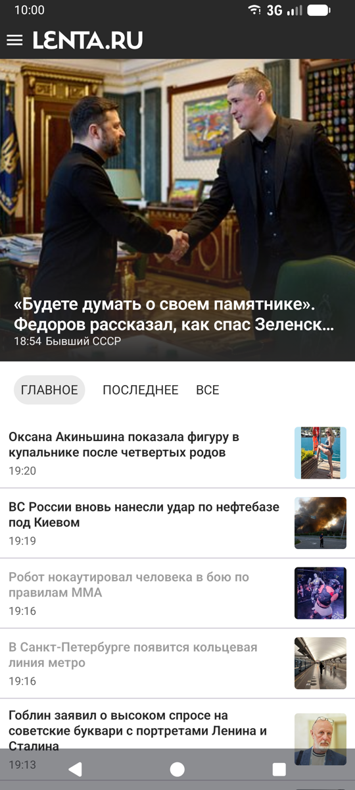
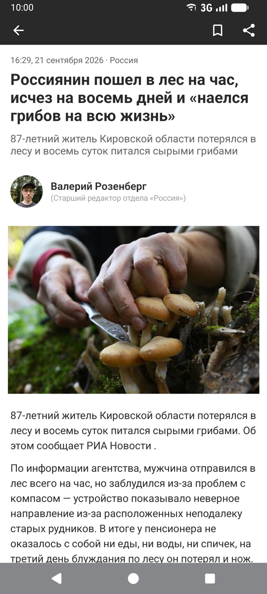
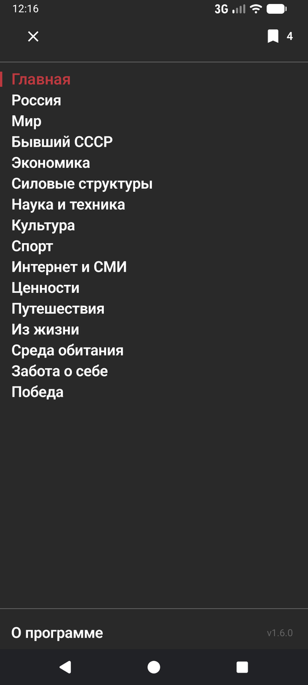
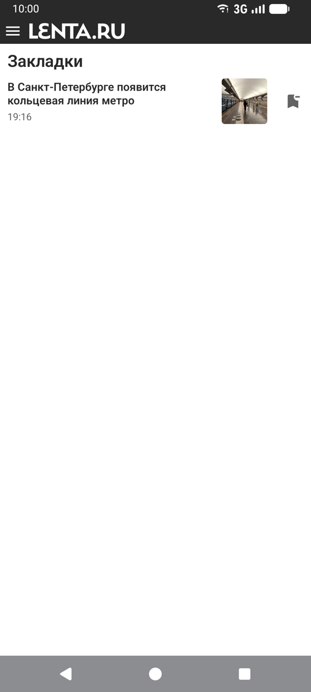

# NewsRSSReader (Android)

Нативное Android-приложение для чтения новостей на Kotlin и Jetpack Compose, отображающее
новости из RSS-лент Lenta.ru. Приложение повторяет дизайн и поведение сайта с минимум возможностей, только чтение новостей используя официальный RSS канал.

На устройстве приложение называется **Lenta Reader**. Это неофициальное приложение: оно не
связано с редакцией Lenta.ru и не имеет к ней отношения — оно лишь читает её открытые RSS-ленты.

## Как это выглядит

Запуск с чистой установки: лента, чтение статьи, отметка прочитанного, сохранение в закладки.

https://github.com/user-attachments/assets/894ae91f-ad42-464b-9294-6dea5d1aeaf5

Копия записи в репозитории, на случай чтения вне GitHub —
[docs/media/demo.mp4](docs/media/demo.mp4).

   

## Возможности

- Просмотр новостей по вкладкам: **Главное** / **Последнее** / **Все**
- Боковое меню с категориями новостей
- Детальный просмотр статьи с блоками контента: абзацы, подзаголовки, изображения, цитаты,
  инфобоксы, подписи авторов
- Отметка прочитанного: заголовок уже открытой новости отличается в списке
- Закладки: статья сохраняется вместе с текстом и фотографиями и читается без интернета
- Полноэкранный просмотр фото с пинч-зумом и сохранением в галерею
- Пункт «О программе» внизу меню: показывает версию сборки и открывает репозиторий проекта

### Прочитанное и закладки

Оба состояния переживают перезапуск приложения и не требуют ни сети, ни новых зависимостей:
данные лежат в `SharedPreferences` и в файлах приложения, JSON пишется вручную на `org.json`.

**Прочитанное.** Новость считается прочитанной по любому из двух признаков, что случится раньше:
три секунды на экране либо тело статьи, прокрученное до конца. Второй признак надёжнее — до конца
статью доскролливает только тот, кто её читал, — и он же покрывает чтение лентой: потянуть в
следующую статью можно лишь с конца текущей. Короткая новость, которая не прокручивается вовсе,
отмечается только по таймеру. Отметки живут 14 дней и вычищаются при запуске в фоновом потоке;
срок с запасом перекрывает окно RSS-ленты Lenta.ru, так что на практике истечение незаметно.

**Закладки.** Кнопка в шапке статьи сохраняет её текст и картинки на диск; картинки по возможности
копируются из дискового кэша Coil, а не скачиваются заново. Список закладок открывается иконкой в
правом верхнем углу бокового меню — рядом с ней число сохранённых, и при нуле иконки нет.

Сохранённый текст используется как **запасной вариант, а не кэш**: при наличии сети статья всегда
загружается заново, и к диску приложение обращается только если загрузка не удалась — тогда
показывается пометка «Сохранённая копия». Поэтому вопрос устаревания копии не возникает, а закладка
открывается без сети и из ленты, не только из списка закладок.

## Технологии

- **Kotlin** + **Jetpack Compose** (API-поверхность Material3, но собственная система дизайн-токенов)
- Архитектура **MVVM** с ViewModel на основе `StateFlow`
- **Navigation-Compose** для навигации между экранами
- **Kotlin Coroutines** для асинхронной работы
- **OkHttp** для сетевых запросов
- **Coil** для асинхронной загрузки и кеширования изображений
- **JUnit4** + **Robolectric** для юнит-тестов

Минимум внешних (production) зависимостей. OkHttp и Coil — единственные
не-AndroidX/не-Kotlin runtime-зависимости. Парсинг RSS/Atom XML и HTML статей реализован вручную
(`android.util.Xml.newPullParser()` и собственный мини-DOM/токенайзер для HTML) без использования
сторонних библиотек парсинга (без Jsoup). Robolectric используется только в тестах.

## Архитектура

Однооконное (single-activity) приложение с `NavHost` на Navigation-Compose:

- `"home"` — главный экран (`HomeScreen`)
- `"category/{key}"` — экран категории, `key` — слаг категории Lenta.ru (например, `"sport"`)
- `"bookmarks"` — список сохранённых статей
- `"article/{id}"` — детальный экран статьи
- `"photo/{encodedUrl}"` — полноэкранный просмотрщик фото

Структура пакетов:

```
com.newsrssreader/
├── data/
│   ├── model/           NewsItem, ArticleContent, ArticleContentType
│   ├── network/          LentaFeedService (клиент OkHttp + карта категорий), FeedParser (RSS 2.0)
│   ├── parser/           SimpleHtmlParser (DOM/токенайзер), LentaArticleParser (парсер тела статьи)
│   ├── store/            состояние на диске: ReadStateStore (прочитанное), BookmarkStore
│   │                       (закладки), сериализаторы ArticleContentJson/NewsItemJson
│   ├── NewsItemCache.kt   in-memory кэш id -> NewsItem для аргументов навигации
│   └── ImageSaver.kt      сохранение изображений в галерею (MediaStore / legacy-подход)
├── ui/
│   ├── theme/             Color.kt, Type.kt, Theme.kt — дизайн-токены
│   ├── components/         NewsRow, NewsTop, NewsTabs, TopPanel, MenuView, Shimmer
│   │   └── article/          блоки контента статьи (абзац, подзаголовок, изображение, цитата и т.д.)
│   ├── home/                HomeScreen + HomeViewModel
│   ├── category/            CategoryScreen + CategoryViewModel
│   ├── article/             ArticleDetailScreen + ArticleViewModel
│   ├── bookmarks/           BookmarksScreen
│   └── photo/                PhotoViewerScreen
└── MainActivity.kt           точка входа; владеет NavHost и оверлеем MenuView
```

Подробное описание архитектуры, дизайн-токенов, сетевого слоя и парсинга RSS/HTML см. в
[CLAUDE.md](CLAUDE.md).

## Где взять

- **GitHub Releases** — готовый APK в [релизах](https://github.com/simakov/NewsRSSReaderAndroid/releases).
  Эта сборка умеет обновлять себя сама: когда выходит новая версия, в боковом меню появляется
  предложение обновиться.
- **F-Droid** — приложение собирается из исходников самим F-Droid'ом и обновляется его клиентом,
  поэтому встроенное обновление в этой сборке отключено, а разрешение на установку пакетов из неё
  убрано. Подробности и порядок подачи заявки — в [docs/fdroid/](docs/fdroid/).

Сборки различаются только этим (product flavors `github` и `fdroid`) и подписаны разными
ключами, так что установить одну поверх другой Android не даст — нужно сначала удалить старую.

## Требования

- JDK 17 или новее
- Android SDK (compileSdk 35, minSdk 26, targetSdk 35)

## Сборка и запуск

Первоначальная настройка — указать Gradle путь к локальному Android SDK:

```bash
echo "sdk.dir=$HOME/Library/Android/sdk" > local.properties
```

Если `JAVA_HOME` не указывает на JDK 17+, задайте переменную окружения перед запуском Gradle:

```bash
export JAVA_HOME=/opt/homebrew/opt/openjdk@21
```

Сборка debug-APK:

```bash
./gradlew :app:assembleGithubDebug
# Результат: app/build/outputs/apk/github/debug/app-github-debug.apk
```

Приложение собирается в двух вариантах (product flavors): `github` — тот, что выкладывается
APK-файлом в GitHub Releases и умеет обновлять себя сам, и `fdroid` — тот, что F-Droid собирает
из исходников; в нём встроенное обновление отключено, потому что обновлениями занимается сам
клиент F-Droid. Для локальной разработки нужен `github`: команда `assembleDebug` без указания
варианта собрала бы оба сразу.

Запуск юнит-тестов:

```bash
./gradlew test
```

Быстрая проверка компиляции:

```bash
./gradlew :app:compileGithubDebugKotlin
```

Установка на подключённое устройство/эмулятор и запуск:

```bash
adb install -r app/build/outputs/apk/github/debug/app-github-debug.apk
adb shell am start -n com.newsrssreader/.MainActivity
```

Отдельного шага генерации проекта для Android Studio не требуется — это обычный Gradle-проект
(`settings.gradle.kts` + `app/build.gradle.kts` + version catalog в
`gradle/libs.versions.toml`); можно открыть его напрямую в Android Studio либо собирать из
командной строки.

## Тестирование

Юнит-тесты находятся в `app/src/test/java/` и покрывают слой данных и ViewModel (парсеры,
форматирование дат, логику лент/категорий, переходы состояний ViewModel, включая обработку отмены
и гонок). Composable-функции, отвечающие только за UI, юнит-тестами не покрываются — их проверяют
вручную, устанавливая собранный APK на эмулятор или устройство.

```bash
./gradlew test                                          # весь набор тестов
./gradlew :app:testGithubDebugUnitTest --tests "com.newsrssreader.data.parser.FeedParserTest"  # один класс
```

## Работа с лентами и категориями

- URL лент: `https://lenta.ru/rss/{top7|last24|news}[/{category}]`
- Список категорий (`LentaFeedService.categories`) должен соответствовать актуальному списку,
  который отдаёт Lenta.ru
- `NewsItem.publishedDate()`: пустая строка, если `published` равно null; `"HH:mm"`, если дата
  совпадает с текущим днём; иначе `"d.MM HH:mm"`

## Лицензия

[GNU General Public License v3.0](LICENSE) или, по вашему выбору, любая более поздняя версия.

Copyright (C) 2025 Andrey Simakov

Это свободная программа: вы можете распространять и изменять её на условиях GPLv3. Она
распространяется в надежде, что будет полезной, но **без каких-либо гарантий** — даже без
неявной гарантии товарной пригодности или пригодности для определённой цели. Полный текст
лицензии — в файле [LICENSE](LICENSE).

Приложение не собирает никакой статистики и не содержит ни аналитических SDK, ни сборщиков
крэшей: единственные сетевые запросы, которые оно делает, — это загрузка лент и статей с
Lenta.ru, загрузка картинок к статьям и (только в варианте `github`) проверка GitHub Releases
на наличие обновления.
